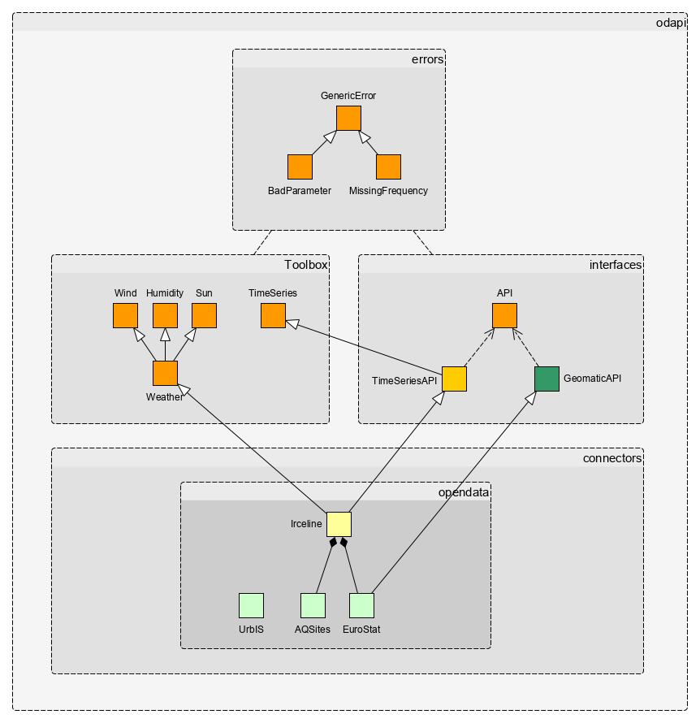

Interfaces
==========

.. automodule:: odapi.interfaces

Interfaces are used to enforce consistency among connectors in our packages.
We implement interface with Abstract Base Classes from Python Standard Library.
Developers are asked to subclass relevant interface to implement new connectors.

API Model
---------

The figure below shows the :py:mod:`odapi` package API model and more precisely
how interfaces are extended and how they can be subclassed to
implement a connector for a specific data model. On this figure the complete
dependency of Irceline connector is showed:

There are several level of abstractions:

 - Module :py:mod:`errors` provides specific Excpetion used by the package;
 - Package :py:mod:`toolbox` provides **staticmethod** mangled in classes, then other objects
   can inherit from them;
 - Package :py:mod:`interfaces` provides **abstractclass** defining interfaces to build
   connectors, all interfaces must inherit from :py:class:`odapi.interfaces.api.API`;
 - Package :py:mod:`connectors` provides implemented interfaces that actual can connect
   an underlying API and fetch data from it. The namespace of this package is mangled
   into thematic subpackages and their connectors are available in the global namespace;

API Setup
---------

Each interface requires on a JSON file describing the source it relies on.
Below an example of such a file (simplified from the Irceline setup):

.. literalinclude:: resources/source.json
   :language: json
   :linenos:

The interface :py:class:`odapi.interfaces.api.API` expects this file as initial
setup and provides accessors to several fields stored in it. It is referenced by
the class member :py:mod:`_setting_path` and is usually stored in the resources folder
of the current subpackage.

Generic API
-----------

API interface copes with underlying data source (REST API, API Client, CLI, static files, etc.),
it provides a common unified way to get token and metadata from source. This interface is generally
too crude to be implemented as this. It is rather a template to build a richer interface such
as :py:class:`odapi.interfaces.timeseries.TimeSeriesAPI`
or :py:class:`odapi.interfaces.geomatic.GeomaticAPI`.

.. automodule:: odapi.interfaces.api
.. autoclass:: odapi.interfaces.api.API
   :members: token, fetch, meta, get_metadata
   :special-members: __init__, _get_token

Time Series API
---------------

TimeSeries interface makes a great deal of having accurate timestamps. Because time
is a complex concept and errors are easy to make but hard to detect, the interface
enforces several aspects to ensure data quality, mainly:

 - Each observation, unless irrelevant, is defined over a time interval instead of being a point;
 - All periods are closed to the left, it means an observation stands for [start, stop) interval;
 - All timestamp are enforced to be Time Zone aware to avoid ambiguity, data loss and undecidability
   when Day Saving Time occurs;
 - All exports are enforced with ISO-8601 standards.

To ease and standardize developments.

.. automodule:: odapi.interfaces.timeseries
.. autoclass:: odapi.interfaces.timeseries.TimeSeriesAPI
   :members: get_records

Geomatic API
------------

.. automodule:: odapi.interfaces.geomatic
.. autoclass:: odapi.interfaces.geomatic.GeomaticAPI
   :members: get_geometries

